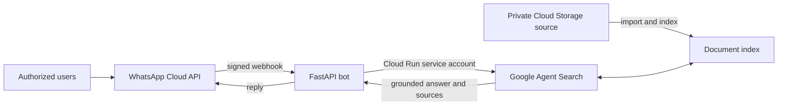

# Enterprise Knowledge Assistant

## Current direction (2026-10-06)

WhatsApp is the active chat channel. LINE is disabled by default with
`LINE_ENABLED=false`; LINE credentials can be empty. The legacy adapter is
retained for older deployments. The existing cloud revision predates this local
change; redeployment is needed to retire its LINE secret references. See
[docs/architecture.md](docs/architecture.md) for the current design.

For customer RAG evaluation, place approved sample files in
`data/private/customer-documents/` for local reading and question preparation.
This directory is ignored by Git and excluded from Cloud Build uploads. Local
files do not automatically enter the knowledge base: upload the selected corpus
to an approved private Cloud Storage bucket, import it into the intended Agent
Search data store, and wait for indexing before testing. Keep the evaluation
questions, expected answers, and results outside the indexed document corpus.

Customer Phase 1 excludes audio and video: do not upload recordings into the search
corpus or transcribe them. For manual ingestion, select document files only.
A future automated upload/sync pipeline must enforce the same file-type filter;
this repository does not yet implement that pipeline. Original audio may remain
in the local customer folder.

Keep customer evaluation documents separate from unrelated demonstration
documents. Verify the app's actual indexed corpus before each benchmark.

A minimal, permission-conscious proof of concept that lets an authorized user
ask questions in WhatsApp and receive source-grounded answers from
documents indexed by Google Agent Search.

> This is an independent portfolio project and is not affiliated with or
> endorsed by LY Corporation or Google.

## POC scope

Included:

- Meta WhatsApp Cloud API as the active chat interface
- WhatsApp webhook challenge and `X-Hub-Signature-256` verification
- WhatsApp phone allowlist
- A private Cloud Storage bucket for synthetic POC documents
- Google Agent Search as the managed retrieval and answer layer
- Answers with up to three source links
- Synthetic documents for a safe public demo
- Health check, automated tests, and a container image

Intentionally deferred:

- Chat file ingestion and automated index refresh
- Solution Library generation
- Audio and video transcription
- Custom embeddings or vector databases
- Multi-department permissions
- Admin dashboard and analytics
- Long-term conversation memory

## Architecture



The POC uses a private Cloud Storage bucket so it can be tested without a paid
Google Workspace tenant. A customer deployment can replace this source with an
approved Google Workspace connector or ingestion pipeline. This repository does
not copy private documents into source control and does not implement its own
vector database.

## Customer Phase 1 target (not yet implemented)

Approved shared files will pass through type, duplicate, version and readability
checks, conversion when needed, storage of search copies, and Agent Search import.
Audio and video are skipped. Conflicts and drafts remain pending review.

Reusable logic is proposed under a new src ingestion package, with a separate
entry point for background execution. A Cloud Run Job is a candidate for batch
processing; packaging modules in a Docker image does not schedule them. The
worker, trigger, source identity and update/deletion behavior have not been
implemented or finalized. See [docs/architecture.md](docs/architecture.md).

## Quick start

Prerequisite: Python 3.10 or newer.

### 1. Prepare the environment

```bash
python3 -m venv .venv
source .venv/bin/activate
python -m pip install --upgrade pip
pip install -r requirements-dev.txt
pip install -e .
cp .env.example .env
```

Fill in `.env` with your WhatsApp Cloud API and Google Agent Search app
settings. Leave `LINE_ENABLED=false` for this scope. Never commit
`.env` or an OAuth credential file.

Leave `AGENT_SEARCH_QUERY_CONTEXT` empty for the current customer benchmark.
Questions are sent without added identity assumptions. This optional setting
can add a non-secret retrieval hint in a future experiment; any change must be
recorded as a new benchmark version.

V2 adds general answer rules through `answerGenerationSpec.promptSpec.preamble`:
preserve conditions, draft status and uncertainty; answer each requested part;
avoid unsupported additions. `AGENT_SEARCH_ANSWER_PREAMBLE` can override these
rules (an empty value disables them). Actual cited filenames are shown below
the answer, using citation references rather than all retrieved documents.
Benchmark changes apply locally; deploying the chat service is a separate step.
The current rules also require concise bullet points starting with the answer,
without introductory source phrases or closing summaries. Necessary dates,
versions, draft status and scope remain in the answer. V2 retains its original
rules and results; V3 tests the newer concise rules together with passage retrieval.

V3 tests explicit passage retrieval with `AGENT_SEARCH_PASSAGE_RETRIEVAL=true`.
The client searches the original question and its subquestions, requests up to
10 verbatim segments with two neighboring segments on either side, deduplicates
them, and searches continued section headings for multi-page lists. It passes
the resulting source text to Answer API through `searchSpec.searchResultList`.
The runtime never reads evaluation questions, expected answers or local customer
documents. The feature defaults to off; V3 enables it only for the benchmark.
Digital Parser and the existing cloud index remain in use. V3 scored 21/30
correct (70.0%), below V2 at 23/30 (76.7%); the experiment remains disabled
and has not been deployed. The next proposed comparison uses a separate data
store with Layout Parser and chunking, keeping the same corpus and questions.

### 2. Configure Cloud Storage search

Create a private Cloud Storage bucket for the POC, upload only synthetic or
approved test documents, import them into an unstructured Agent Search data
store, and attach that data store to a search app. See
[docs/google-agent-search-setup.md](docs/google-agent-search-setup.md).

For local POC testing, authenticate with Application Default Credentials:

```bash
gcloud auth application-default login
```

### 3. Test the knowledge layer first

```bash
python -m enterprise_knowledge_assistant.cli "What did we decide about onboarding?"
```

Only connect a messaging channel after the command returns a grounded answer
from the expected documents.

### 4. Run the webhook

```bash
uvicorn enterprise_knowledge_assistant.app:app --reload --port 8080
```

Expose port `8080` through an HTTPS endpoint, then configure the WhatsApp
webhook below. The legacy LINE callback is disabled in the local default config.

### 5. Configure WhatsApp Cloud API

In the Meta developer dashboard, add WhatsApp to the app and configure:

- callback URL: `https://YOUR-HOST/webhooks/whatsapp`;
- verify token: the same value as `WHATSAPP_VERIFY_TOKEN`;
- webhook field: `messages`;
- App Secret, permanent access token, and Phone Number ID in the corresponding
  environment variables;
- approved tester numbers in `WHATSAPP_ALLOWED_PHONE_NUMBERS`.

The sender numbers may include `+`, spaces, or hyphens; the service normalizes
them to the digits-only IDs delivered by Cloud API. The integration is pinned to
Graph API `v26.0` by default, but the deployed value should be reviewed against
Meta's supported versions during routine maintenance. See Meta's
[Cloud API setup guide](https://developers.facebook.com/docs/whatsapp/cloud-api/get-started)
and [official Cloud API collection](https://www.postman.com/meta/whatsapp-business-platform/collection/wlk6lh4/whatsapp-cloud-api).

### Rotate the WhatsApp access token

Use the rotation helper instead of putting a token in shell history:

```bash
.venv/bin/python scripts/rotate_whatsapp_token.py
```

It validates the token, idempotently checks the WABA subscription, creates a new
Secret Manager version, updates Cloud Run, and runs smoke tests. If `.env` was
already updated manually, add `--from-env`. See the complete
[WhatsApp token-rotation runbook](docs/whatsapp-token-rotation.md), including
read-only checks and rollback instructions.

## Safe demo

The files under [`demo-data/`](demo-data/) are fictional. Convert them to a
supported upload format such as TXT or PDF and place them in a private demo
bucket to record screenshots or a portfolio video without exposing a real
company's documents.

Suggested questions:

- What is the escalation path for a critical customer issue?
- What did the team decide about onboarding?
- When should a support case be escalated?

## Security boundary

The public repository may contain reusable code, architecture, synthetic data,
and placeholder configuration only. Production content, identifiers,
credentials, chat logs, and deployment configuration belong in a separate
private environment. See [SECURITY.md](SECURITY.md) and
[docs/publication-checklist.md](docs/publication-checklist.md).

## Current POC limitations

- It is designed for one or a few explicitly allowlisted testers.
- One-time Cloud Storage imports must be refreshed when documents change.
- The active channel answers WhatsApp text messages. Non-text WhatsApp users
  receive a text-only notice. File
  ingestion is a documented target, not a completed POC capability.
- Direct Workspace federation or per-user Drive ACL enforcement requires secure
  user-to-Workspace account linking and separate validation in the customer's
  tenant; the Phase 1 dedicated-folder ingestion model does not claim that level
  of authorization.
- The messaging webhook performs the search synchronously. A production system
  should add a queue, retry policy, durable webhook deduplication, and a
  channel-specific completion message flow.
- The POC intentionally avoids custom retrieval logic so the knowledge-base
  value can be validated before more infrastructure is added.

## Tests

```bash
pytest -q
```

## License

No open-source license has been selected yet. Choose one only after confirming
the publication and code-ownership terms with the project stakeholder.
