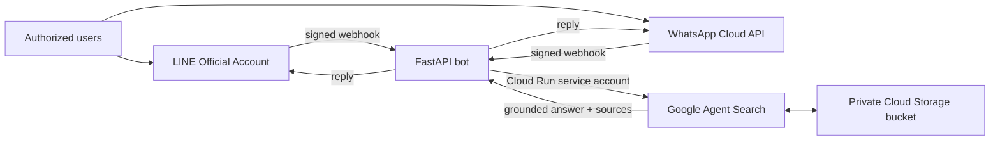

# Enterprise Knowledge Assistant

A minimal, permission-conscious proof of concept that lets an authorized user
ask questions in LINE or WhatsApp and receive source-grounded answers from
documents indexed by Google Agent Search.

> This is an independent portfolio project and is not affiliated with or
> endorsed by LY Corporation or Google.

## POC scope

Included:

- LINE Official Account and Meta WhatsApp Cloud API as chat interfaces
- LINE webhook signature verification
- WhatsApp webhook challenge and `X-Hub-Signature-256` verification
- Separate LINE and WhatsApp user allowlists
- A private Cloud Storage bucket for synthetic POC documents
- Google Agent Search as the managed retrieval and answer layer
- Answers with up to three source links
- Synthetic documents for a safe public demo
- Health check, automated tests, and a container image

Intentionally deferred:

- LINE or WhatsApp file ingestion and automated index refresh
- Solution Library generation
- Audio and video transcription
- Custom embeddings or vector databases
- Multi-department permissions
- Admin dashboard and analytics
- Long-term conversation memory

## Architecture



The POC uses a private Cloud Storage bucket so it can be tested without a paid
Google Workspace tenant. A customer deployment can replace this source with an
approved Google Workspace connector or ingestion pipeline. This repository does
not copy private documents into source control and does not implement its own
vector database.

## Customer Phase 1 target (not yet implemented)

The selected Phase 1 direction extends the text-only POC with two controlled
document entry paths:

- authorized uploaders can send supported documents to the LINE Official Account;
- an approved Google Drive or Shared Drive folder is synchronized by a dedicated
  integration identity with access limited to that scope.

Drive is the canonical document location. A LINE upload is validated and
deduplicated in private Cloud Storage quarantine, then published to a dedicated
Drive inbox before the normal Drive-to-Agent-Search pipeline indexes it. This
prevents the LINE and Drive paths from creating two search documents for the same
file. LINE users are not granted Cloud Storage console or bucket access. Query
and upload allowlists are separate, and audio transcription remains a later-phase
feature. See [docs/architecture.md](docs/architecture.md) for the target flow and
security trade-offs. Full per-user Drive ACL synchronization is a separate,
enterprise-level scope and is not part of the basic Phase 1 proposal.

## Quick start

Prerequisite: Python 3.10 or newer.

### 1. Prepare the environment

```bash
python3 -m venv .venv
source .venv/bin/activate
python -m pip install --upgrade pip
pip install -r requirements-dev.txt
pip install -e .
cp .env.example .env
```

Fill in `.env` with your LINE Messaging API channel and Google Agent Search app
settings. Add the WhatsApp values when that channel is enabled. Never commit
`.env` or an OAuth credential file.

For short or first-person POC questions, `AGENT_SEARCH_QUERY_CONTEXT` can add a
non-secret retrieval hint. For example, a single-user resume demo can explain
that first-person references mean the person described by the resume. The hint
is appended only to the Agent Search query and is not shown in chat replies.

### 2. Configure Cloud Storage search

Create a private Cloud Storage bucket for the POC, upload only synthetic or
approved test documents, import them into an unstructured Agent Search data
store, and attach that data store to a search app. See
[docs/google-agent-search-setup.md](docs/google-agent-search-setup.md).

For local POC testing, authenticate with Application Default Credentials:

```bash
gcloud auth application-default login
```

### 3. Test the knowledge layer first

```bash
python -m enterprise_knowledge_assistant.cli "What did we decide about onboarding?"
```

Only connect a messaging channel after the command returns a grounded answer
from the expected documents.

### 4. Run the webhook

```bash
uvicorn enterprise_knowledge_assistant.app:app --reload --port 8080
```

Expose port `8080` through an HTTPS endpoint. Keep the existing LINE callback,
or use its clearer alias:

```text
https://YOUR-HOST/callback
https://YOUR-HOST/webhooks/line
```

as the LINE Messaging API webhook URL. Add your LINE user ID to
`LINE_ALLOWED_USER_IDS` before testing.

### 5. Configure WhatsApp Cloud API

In the Meta developer dashboard, add WhatsApp to the app and configure:

- callback URL: `https://YOUR-HOST/webhooks/whatsapp`;
- verify token: the same value as `WHATSAPP_VERIFY_TOKEN`;
- webhook field: `messages`;
- App Secret, permanent access token, and Phone Number ID in the corresponding
  environment variables;
- approved tester numbers in `WHATSAPP_ALLOWED_PHONE_NUMBERS`.

The sender numbers may include `+`, spaces, or hyphens; the service normalizes
them to the digits-only IDs delivered by Cloud API. The integration is pinned to
Graph API `v26.0` by default, but the deployed value should be reviewed against
Meta's supported versions during routine maintenance. See Meta's
[Cloud API setup guide](https://developers.facebook.com/docs/whatsapp/cloud-api/get-started)
and [official Cloud API collection](https://www.postman.com/meta/whatsapp-business-platform/collection/wlk6lh4/whatsapp-cloud-api).

### Rotate the WhatsApp access token

Use the rotation helper instead of putting a token in shell history:

```bash
.venv/bin/python scripts/rotate_whatsapp_token.py
```

It validates the token, idempotently checks the WABA subscription, creates a new
Secret Manager version, updates Cloud Run, and runs smoke tests. If `.env` was
already updated manually, add `--from-env`. See the complete
[WhatsApp token-rotation runbook](docs/whatsapp-token-rotation.md), including
read-only checks and rollback instructions.

## Safe demo

The files under [`demo-data/`](demo-data/) are fictional. Convert them to a
supported upload format such as TXT or PDF and place them in a private demo
bucket to record screenshots or a portfolio video without exposing a real
company's documents.

Suggested questions:

- What is the escalation path for a critical customer issue?
- What did the team decide about onboarding?
- When should a support case be escalated?

## Security boundary

The public repository may contain reusable code, architecture, synthetic data,
and placeholder configuration only. Production content, identifiers,
credentials, chat logs, and deployment configuration belong in a separate
private environment. See [SECURITY.md](SECURITY.md) and
[docs/publication-checklist.md](docs/publication-checklist.md).

## Current POC limitations

- It is designed for one or a few explicitly allowlisted testers.
- One-time Cloud Storage imports must be refreshed when documents change.
- The current code answers text messages from LINE and WhatsApp. Non-text LINE
  messages are ignored; WhatsApp users receive a text-only notice. File
  ingestion is a documented target, not a completed POC capability.
- Direct Workspace federation or per-user Drive ACL enforcement requires secure
  LINE-to-Workspace account linking and separate validation in the customer's
  tenant; the Phase 1 dedicated-folder ingestion model does not claim that level
  of authorization.
- Both messaging webhooks perform the search synchronously. A production system
  should add a queue, retry policy, durable webhook deduplication, and a
  channel-specific completion message flow.
- The POC intentionally avoids custom retrieval logic so the knowledge-base
  value can be validated before more infrastructure is added.

## Tests

```bash
pytest -q
```

## License

No open-source license has been selected yet. Choose one only after confirming
the publication and code-ownership terms with the project stakeholder.
