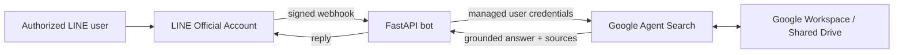

# Enterprise Knowledge Assistant

A minimal, permission-conscious proof of concept that lets an authorized user
ask questions in LINE and receive source-grounded answers from company content
stored in Google Workspace.

> This is an independent portfolio project and is not affiliated with or
> endorsed by LY Corporation or Google.

## POC scope

Included:

- LINE Official Account as the chat interface
- LINE webhook signature verification
- Explicit LINE user allowlist
- Google Drive as the source of truth
- Google Agent Search as the managed retrieval and answer layer
- Answers with up to three source links
- Synthetic documents for a safe public demo
- Health check, automated tests, and a container image

Intentionally deferred:

- Solution Library generation
- Audio and video transcription
- Custom embeddings or vector databases
- Multi-department permissions
- Admin dashboard and analytics
- Long-term conversation memory

## Architecture



Google Drive remains the authoritative content store. This repository does not
copy production documents into source control and does not implement its own
vector database.

## Quick start

Prerequisite: Python 3.10 or newer.

### 1. Prepare the environment

```bash
python3 -m venv .venv
source .venv/bin/activate
python -m pip install --upgrade pip
pip install -r requirements-dev.txt
pip install -e .
cp .env.example .env
```

Fill in `.env` with a LINE Messaging API channel and your Google Agent Search
app settings. Never commit `.env` or an OAuth credential file.

### 2. Configure Google Drive search

Create a dedicated Google Shared Drive or folder for the POC, add only approved
test documents, and connect it to an Agent Search app. See
[docs/google-agent-search-setup.md](docs/google-agent-search-setup.md).

Google Workspace-backed Agent Search does **not** support search using ordinary
service-account credentials. For local POC testing, authenticate with a managed
Workspace user that can access the selected Drive content:

```bash
gcloud auth application-default login
```

### 3. Test the knowledge layer first

```bash
python -m enterprise_knowledge_assistant.cli "What did we decide about onboarding?"
```

Only connect LINE after the command returns a grounded answer from the expected
documents.

### 4. Run the webhook

```bash
uvicorn enterprise_knowledge_assistant.app:app --reload --port 8080
```

Expose port `8080` through an HTTPS endpoint and register:

```text
https://YOUR-HOST/callback
```

as the LINE Messaging API webhook URL. Add your LINE user ID to
`LINE_ALLOWED_USER_IDS` before testing.

## Safe demo

The files under [`demo-data/`](demo-data/) are fictional. Upload them to a
separate demo Drive folder to record screenshots or a portfolio video without
exposing a real company's documents.

Suggested questions:

- What is the escalation path for a critical customer issue?
- What did the team decide about onboarding?
- When should a support case be escalated?

## Security boundary

The public repository may contain reusable code, architecture, synthetic data,
and placeholder configuration only. Production content, identifiers,
credentials, chat logs, and deployment configuration belong in a separate
private environment. See [SECURITY.md](SECURITY.md) and
[docs/publication-checklist.md](docs/publication-checklist.md).

## Current POC limitations

- It is designed for one or a few explicitly allowlisted testers.
- Workspace Drive search must run with a managed user's identity. A production
  rollout requires secure LINE-to-Workspace account linking.
- The webhook performs the search synchronously. A production system should
  add a queue, retry policy, and push-message completion flow.
- The POC intentionally avoids custom retrieval logic so the knowledge-base
  value can be validated before more infrastructure is added.

## Tests

```bash
pytest -q
```

## License

No open-source license has been selected yet. Choose one only after confirming
the publication and code-ownership terms with the project stakeholder.
