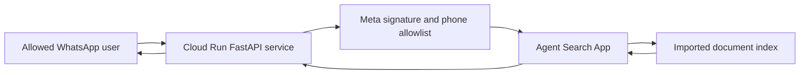
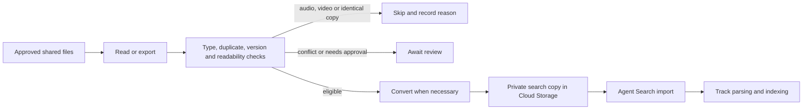

# Architecture — Current Direction

Updated: 2026-10-06. WhatsApp is the active channel. Live resource identifiers
and the read-only cloud inventory remain in local private notes.

## Implemented question-answering path

Questions search an imported index; they do not directly read Drive or Cloud
Storage objects. The cloud index now contains the eight customer evaluation
documents verified during V1. Current local and cloud query context is empty; V1 records
retain the settings used for that baseline. Local code disables LINE by default; the
previously deployed revision must be updated before retiring LINE secrets.

## Proposed document pipeline — not implemented

Phase 1 excludes audio and video. Evaluation questions, expected answers,
results and local extraction artifacts never enter the search corpus.
SHA-256 detects byte-identical files; equal filenames with different content
need version handling or review. Parser output must preserve important tables,
notes and draft status. Business correctness remains with the knowledge owner.

The source scope, integration identity, supported formats, version/deletion
behavior and execution trigger require agreement before implementation.
Automatic Drive synchronization, a document registry and import orchestration
are not current application capabilities.

## Code organization and cloud execution

Reusable logic is proposed under src/enterprise_knowledge_assistant/ingestion/:
source reading, validation, deduplication, conversion, publishing and pipeline
orchestration. This package has not been created. Scripts or CLI entry points
will call it rather than duplicate its logic.

The Dockerfile packages src and starts the FastAPI HTTP application. Packaging
another module does not execute it, create a function or schedule a job.

| Runtime | Responsibility | Status |
| --- | --- | --- |
| Cloud Run service | Messaging webhooks and question answering | Deployed |
| Cloud Run Job | Process a batch and exit | Proposed; no job deployed |
| Cloud Run functions | Handle a discrete HTTP request or cloud event | Alternative, not the current document worker |
| Scheduler or event trigger | Start background processing | Not implemented for this pipeline |

One Cloud Run Job is a candidate for batch ingestion, first run manually and
later scheduled if needed. Individual Python functions do not each require a
cloud deployment. Source-defined Cloud Run functions are also built into
containers and deployed as services.

References: [Cloud Run resource model](https://docs.cloud.google.com/run/docs/resource-model),
[Cloud Run functions comparison](https://docs.cloud.google.com/run/docs/functions/comparison).

## Current boundaries

- A dedicated service account authenticates the deployed query workload.
- Meta signatures and a phone allowlist protect the application path.
- Allowed users share one corpus; per-user Drive ACLs are not implemented.
- Queries still wait synchronously. Durable retries and asynchronous completion
  require separate implementation.
- The customer evaluation question set is prepared but has not been executed.
- No custom vector database or embedding pipeline is deployed.

Revisit triggers, state storage, permissions and retries when document volume,
update frequency and acceptance criteria are set.
