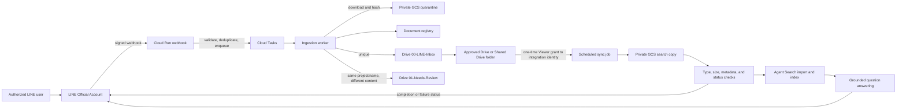

# Architecture Decision — Managed Search POC

## Context

The target customer stores source material in Google Workspace, but the
portfolio developer does not have a managed Workspace tenant. The first goal is
to validate knowledge-base question answering through LINE without borrowing a
customer account or exposing company data.

## Decision

Use LINE Messaging API and Meta WhatsApp Cloud API as parallel interfaces, a
small FastAPI webhook service for orchestration, and Google Agent Search
connected to a private Cloud Storage bucket containing synthetic documents.
Both channels call the same retrieval boundary so a customer deployment can
change the knowledge source without duplicating chat-channel logic.

## Data flow

1. An allowlisted tester sends a text message to LINE or WhatsApp.
2. The provider posts a signed webhook event to `/webhooks/line` or
   `/webhooks/whatsapp`.
3. The service verifies the provider-specific signature and channel allowlist.
4. The question is sent to Agent Search using Google Cloud credentials.
5. Agent Search searches the indexed Cloud Storage documents and returns an answer
   with source metadata.
6. The channel adapter sends the same answer and up to three source links back
   through LINE or WhatsApp.

## Key trade-offs

### Managed Agent Search instead of custom RAG

Benefits:

- Faster path to validating user value
- No vector database, chunk synchronization, or deletion pipeline
- No paid Workspace tenant is required for the portfolio POC
- Cloud Run can use a dedicated service account

Costs:

- Less control over chunking, retrieval, and reranking
- One-time imports do not provide automatic freshness
- Continued dependency on Google Cloud pricing and APIs

### Synchronous webhook for the POC

Benefits:

- Minimal components
- Easy local debugging

Costs:

- Long searches can delay the LINE reply
- No durable retries

Revisit this after the POC. A production version should acknowledge the webhook
quickly, enqueue the query, and deliver the completed answer with a LINE push
message.

## Security assumptions

- Only explicitly allowlisted LINE IDs and WhatsApp phone numbers can use the POC.
- WhatsApp verification uses a separate verify token for Meta's GET challenge;
  webhook POST bodies must also match `X-Hub-Signature-256` using the Meta App
  Secret.
- All POC testers are authorized to view the entire selected demo corpus.
- Real documents and conversation logs are never stored in this repository.
- Application logs contain error types, not questions, answers, or documents.

These assumptions are not sufficient for a multi-department rollout. Direct
Workspace federation with per-user Drive ACLs requires account linking and
per-user access enforcement; a multi-corpus ingestion-based version requires
document ACL metadata and retrieval-time filtering. The Phase 1 target below
uses one approved corpus instead.

## Phase 1 target architecture (not yet implemented)

Phase 1 adds document ingestion from LINE and synchronization from one approved
Drive folder. Drive is the canonical document location; LINE is an upload
interface, not a second document system. WhatsApp currently shares the text QA
path only; WhatsApp media ingestion requires a separate scope decision.

### Upload and authentication decision

- LINE uploaders do not receive Google Cloud IAM or direct bucket access. The
  deployed workload writes to Cloud Storage through its attached, single-purpose
  service account.
- Query and upload authorization are separate. Phase 1 should allow only a small
  set of knowledge owners to publish documents.
- The LINE publishing worker has write access only to `00-LINE-Inbox` and
  `01-Needs-Review`. The query service has no Drive permission.
- Existing Workspace content is limited to a dedicated Drive or Shared Drive
  scope. The customer grants a dedicated integration identity Viewer access to
  that scope once; ordinary LINE queries never call Drive or ask users to grant
  Google access. Do not use an employee's broad personal OAuth grant.
- If organization policy blocks a service account from the approved Drive scope,
  use a dedicated customer-managed Workspace integration user whose visible data
  is limited to that scope. Domain-wide delegation is not the default.
- Direct Cloud Storage console access is reserved for technical administrators.
  A future browser upload portal should authenticate the user in the application
  and issue a short-lived signed URL for one destination object.

### Canonical document and duplicate handling

- Drive is the only customer-managed source of truth. GCS LINE objects are
  temporary quarantine; GCS Drive objects are rebuildable search copies.
- `webhookEventId + messageId` deduplicates LINE delivery and retry events.
- SHA-256 content hashes detect byte-identical uploads across LINE and Drive.
- The same Drive `fileId` always maps to one internal `kb_document_id` and one
  Agent Search document ID, even when content or folder location changes.
- The same normalized filename within one project scope, but with different
  bytes, is not overwritten automatically. It is placed in `01-Needs-Review`
  and excluded from search until a knowledge owner resolves it.
- Cross-format semantic duplicates, such as a Google Doc and an exported PDF,
  are only flagged for review in Phase 1; they are not auto-merged.

### Why not use Agent Search's Drive data store directly in Phase 1

Agent Search does not support searching a Workspace data store with service
account credentials. It also requires managed users in the same Workspace
organization and adds identity-provider and account-linking work. The Phase 1
permission model is intentionally simpler: all query-allowlisted users can read
the same approved corpus, so the system copies approved content into a private
Cloud Storage-derived search index. Fine-grained, per-user Drive ACL enforcement
requires a separate design and acceptance plan.

### Deferred media path

Audio and video ingestion is deferred to a later phase. It will reuse the same
queue and staging area but add Speech-to-Text, transcript QA, structured meeting
metadata, and an approval step before publication.
